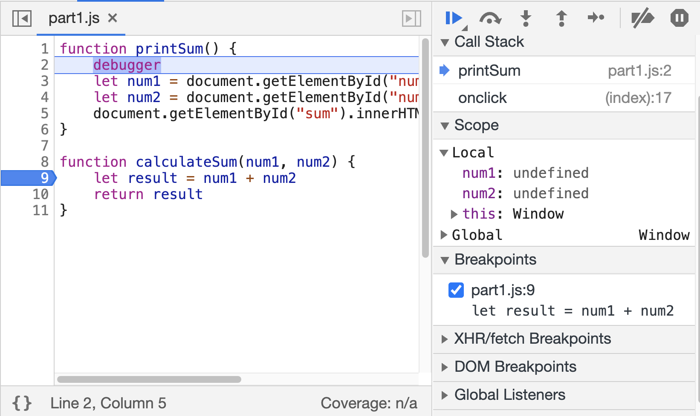
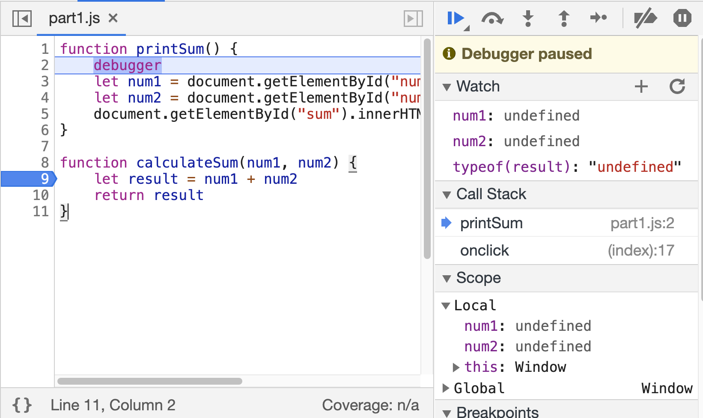
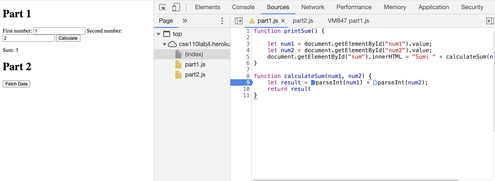

# Part 1
## Screenshot for breakpoints:

## Screenshot for watch lists:

## Questions
1. The bug is because both num1 and num2 has type string, so the result is concatenating the two strings instead of adding them as number.
2. I fixed it by replacing num1 by parseInt(num1), and replacing num2 by parseInt(num2). Then we would get the numeric sum of two values. Screenshot of fix:

# Part 2
1. citylots.json
2. part2.js
3. 11.1MB
4. 5.58s
5. Mozilla/5.0 (Macintosh; Intel Mac OS X 10_15_7) AppleWebKit/605.1.15 (KHTML, like Gecko) Version/14.0 Safari/605.1.15.
6. Apache
7. Tue, 26 Jan 2021 22:14:13 GMT
8. application/json
9. fetchData()
